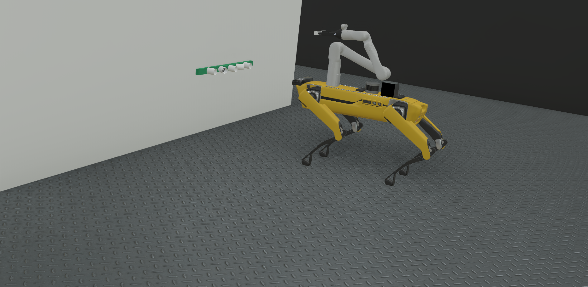

# Webots ROS2 Spot

[](https://github.com/MASKOR/webots_ros2_spot/actions/workflows/test_ros2_humble.yml)

This is a ROS 2 package to simulate the Boston Dynamics spot in [webots](https://cyberbotics.com/). Spot is able to walk around, to sit, standup and lie down. We also attached some sensors on spot, like a kinect and a 3D laser.
The world contains apriltags, a red line to test lane follower and objects for manipulation tasks.



## Prerequisites

    - Ubuntu 22.04
    - ROS2 Humble https://docs.ros.org/en/humble/Installation/Ubuntu-Install-Debians.html
    - Webots 2025a https://github.com/cyberbotics/webots/releases/tag/R2025a

## Install

1. Install ROS2 Development tools and initialise and update rosdep:
    ```
    sudo apt install -y ros-dev-tools
    ```
    ```
    source /opt/ros/humble/setup.bash
    sudo rosdep init
    rosdep update
    ```

2. Create a new ROS2 workspace:
    ```
    export COLCON_WS=~/ros2_ws
    mkdir -p $COLCON_WS/src
    ```

3. Pull relevant packages, install dependencies, compile, and source the workspace by using:
    ```
    cd $COLCON_WS
    git clone https://github.com/MASKOR/webots_ros2_spot src/webots_ros2_spot
    rosdep install --ignore-src --from-paths src -y -r
    vcs import --recursive src --skip-existing --input src/webots_ros2_spot/webots_ros2_spot.repos
    chmod +x src/webots_ros2/webots_ros2_driver/webots_ros2_driver/ros2_supervisor.py
    ```

4. Build packages and source the workspace
    ```
    colcon build --symlink-install
    source install/setup.bash
    ```

## Start
Starting the simulation:
```
ros2 launch webots_spot spot_launch.py
```

Send joint positions
```
ros2 topic pub --once /joint_trajectory_controller/joint_trajectory trajectory_msgs/JointTrajectory "{
  header: { stamp: { sec: 0, nanosec: 0 }, frame_id: '' },
  joint_names: ['joint_1', 'joint_2', 'joint_3', 'joint_4', 'joint_5', 'joint_6'],
  points: [
    {
      positions: [3.14, 1.9, 3.0, 0.0, 1.0, -1.57],
      velocities: [0.0, 0.0, 0.0, 0.0, 0.0, 0.0],
      accelerations: [],
      effort: [],
      time_from_start: { sec: 3, nanosec: 0 }
    }
  ]
}"
```

Motion Planning with MoveIt
```
ros2 launch webots_spot moveit_launch.py 
```


## Troubleshoot ERROR with mesh/stl

copy the 2f_140 folder in "opt/ros/humble/share/robotiq_description/meshes/visual" and "opt/ros/humble/share/robotiq_description/meshes/collision"
